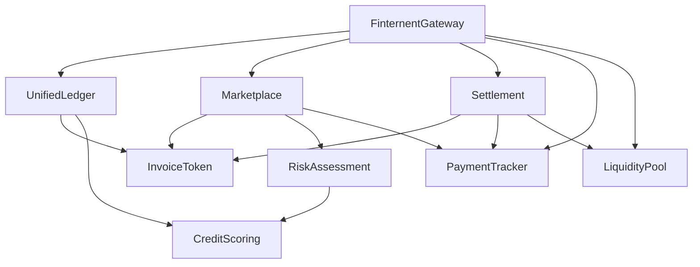

# Contract Deployment and Integration Guide

## Overview

This document provides instructions for deploying and interacting with the Fylaro smart contracts on Arbitrum networks.

## Contract Architecture



## Prerequisites

1. Node.js v16 or later
2. Hardhat development environment
3. Arbitrum RPC endpoints
4. Wallet with sufficient ETH for deployment
5. Arbiscan API key for contract verification

## Environment Setup

1. Copy `.env.example` to `.env`
2. Fill in the required values:
   - DEPLOYER_PRIVATE_KEY
   - ARBITRUM_RPC_URL
   - ARBITRUM_SEPOLIA_RPC_URL
   - ARBITRUM_EXPLORER_API_KEY

## Deployment Steps

1. Install dependencies:
   ```bash
   npm install
   ```

2. Compile contracts:
   ```bash
   npx hardhat compile
   ```

3. Deploy to Arbitrum Sepolia (testnet):
   ```bash
   npx hardhat deploy --network arbitrumSepolia --tags Fylaro
   ```

4. Deploy to Arbitrum (mainnet):
   ```bash
   npx hardhat deploy --network arbitrum --tags Fylaro
   ```

## Contract Dependencies

1. InvoiceToken
   - No dependencies
   - Must grant MINTER_ROLE to Marketplace
   - Must grant BURNER_ROLE to Settlement

2. CreditScoring
   - No dependencies
   - Initialize with default parameters

3. RiskAssessment
   - Depends on CreditScoring
   - Must be granted access to credit data

4. LiquidityPool
   - Depends on InvoiceToken
   - Must be granted OPERATOR_ROLE to Settlement

5. PaymentTracker
   - Depends on InvoiceToken
   - Must grant MANAGER_ROLE to Settlement and Marketplace

6. Settlement
   - Depends on InvoiceToken, PaymentTracker, LiquidityPool
   - Must be granted necessary roles on dependent contracts

7. Marketplace
   - Depends on InvoiceToken, RiskAssessment, PaymentTracker
   - Must be granted necessary roles on dependent contracts

8. UnifiedLedger
   - Depends on InvoiceToken, CreditScoring, Marketplace, Settlement, PaymentTracker
   - Coordinates between all contracts

9. FinternentGateway
   - Main entry point for the system
   - Depends on all other contracts
   - Must be granted admin roles on all contracts

## Post-Deployment Verification

1. Check contract verification on Arbiscan
2. Verify all roles are properly granted
3. Test basic functions:
   - Token minting
   - Invoice creation
   - Payment tracking
   - Settlement process

## Contract Interaction

Use the `contracts.ts` helper file for common interactions:

```typescript
import { contractHelpers } from '@/lib/contracts';

// Mint invoice tokens
await contractHelpers.mintInvoiceToken(signer, address, tokenId, amount);

// Check credit score
const score = await contractHelpers.getCreditScore(address, chainId);

// Assess risk for an invoice
await contractHelpers.assessRisk(signer, invoiceId);

// Deposit liquidity
await contractHelpers.depositLiquidity(signer, amount);

// Track a payment
await contractHelpers.trackPayment(signer, invoiceId, amount);

// Settle an invoice
await contractHelpers.settleInvoice(signer, invoiceId);

// List an invoice
await contractHelpers.listInvoice(signer, invoiceId, price);
```

## Event Listeners

Set up event listeners for contract events:

```typescript
import { setupContractListeners } from '@/lib/contracts';

const callbacks = {
  onTransfer: (from, to, tokenId) => {
    console.log('Token transferred:', { from, to, tokenId });
  },
  onListingCreated: (listingId, seller, price) => {
    console.log('New listing:', { listingId, seller, price });
  },
  onPaymentRecorded: (invoiceId, amount) => {
    console.log('Payment recorded:', { invoiceId, amount });
  }
};

// Setup listeners
const cleanup = setupContractListeners(chainId, callbacks);

// Cleanup when done
cleanup();
```

## Troubleshooting

1. Contract Verification Issues
   - Ensure correct compiler version in hardhat.config.js
   - Wait for sufficient block confirmations
   - Check constructor arguments match deployment

2. Role Assignment Issues
   - Verify deployer has admin role
   - Check role constants match contract
   - Use proper role assignment order

3. Network Issues
   - Verify RPC endpoints are responsive
   - Check gas settings in config
   - Ensure sufficient ETH balance

## Security Considerations

1. Role Management
   - Keep track of all role assignments
   - Implement proper access control
   - Plan for role revocation

2. Upgrades
   - Use transparent proxy pattern
   - Plan upgrade paths
   - Test upgrades on testnet first

3. Emergency Procedures
   - Implement pause mechanisms
   - Have emergency contacts ready
   - Document recovery procedures

## Testing

1. Run unit tests:
   ```bash
   npx hardhat test
   ```

2. Run integration tests:
   ```bash
   npx hardhat test:integration
   ```

3. Run on testnet:
   ```bash
   npx hardhat test:testnet
   ```

## Maintenance

1. Regular monitoring of:
   - Contract events
   - Gas usage patterns
   - Error rates
   - Role assignments

2. Periodic tasks:
   - Check for pending upgrades
   - Verify role assignments
   - Monitor contract balances

## Support

For technical support:
1. Check the documentation first
2. Review deployment logs
3. Check contract events
4. Contact the development team
